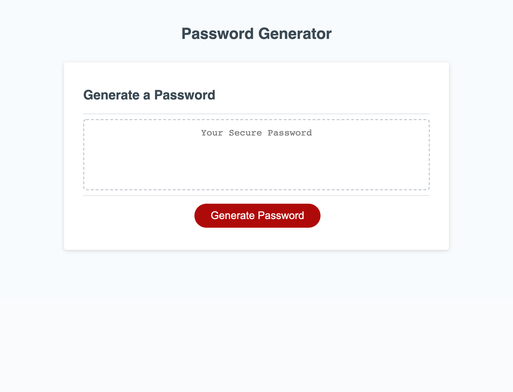
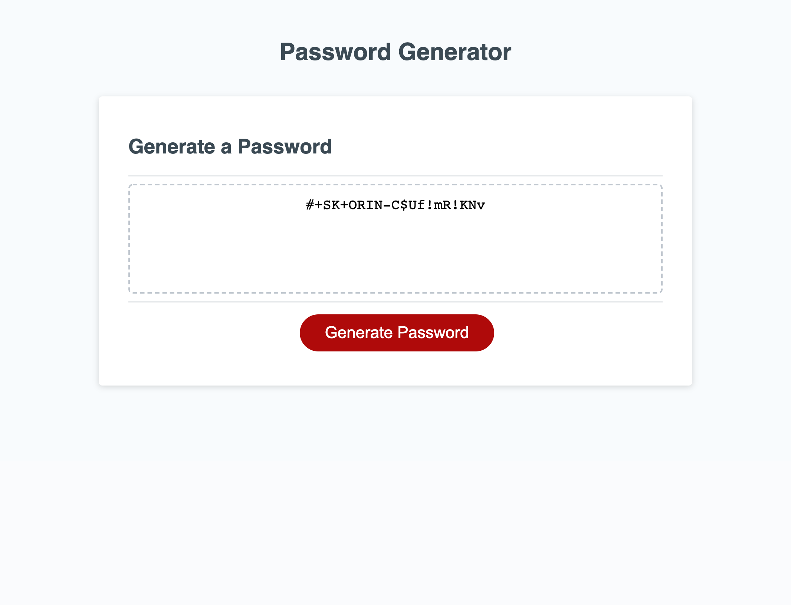

# password-generator
This application generates a password in the browser.

    - The user clicks on the "Generte Password" button to initate a prompt asking for a desired password length.
        - The password length can neither be less than 8 characters nor greater than 128 characters.
            -If the user enters a value outside of these bounds, they are given an alert and must restart the process.
            -If the user enters a non-numerical character, they will be given an alert and must restart the process.
    -Once the user enters a valid password length, they are given a series of confirm boxes asking if they want special characters, numbers, lower case letters, and/or upper case letters.
        -The user must choose "OK" for at least one of the criteria. If they do not, they are given an alert and must restart the process.
    -Once the user selects at least one criteria, a random password (of the user's desired length) appears in the dashed box.
    -The user may click "Generate Password" again to restart the process.

See URL for demo: https://meierj423.github.io/password-generator/

